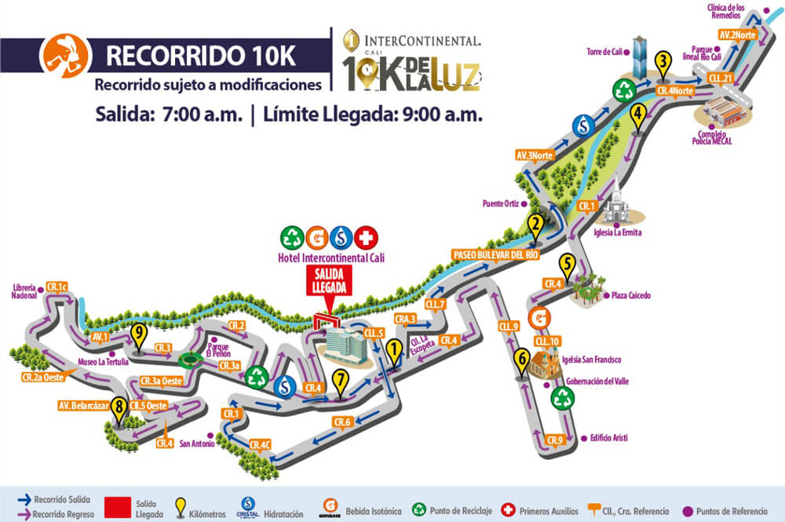

```{r setup, include=FALSE}
# Importar librerías necesarias ------------------------------------------------
library(flexdashboard)
library(paqueteMET)

library(ggplot2)
library(hrbrthemes)
library(viridis)

library(dplyr)
library(stringr)
library(tidyverse)
# library(lubridate)

library(maps)


# Datos y subconjuntos de datos ------------------------------------------------
# Dataframe
data("CarreraLuz22")

df = CarreraLuz22


# Géneros
tabla_genero = table(df["sex"])
tabla_genero = data.frame(tabla_genero)
colnames(tabla_genero) = c("Sex", "n")

freq_genero = tabla_genero %>%
  mutate(freq = paste(round(n / sum(n) * 100, 1), "%")) %>%
  mutate(label_position =  cumsum(n) - n / 2 - 200) %>%
  mutate(label_position = sort(label_position, decreasing = TRUE))

df_genero = df %>% select(2)


# Origen participantes
tabla_origen = table(df["origen"])
tabla_origen = as.data.frame(tabla_origen)

df_origen = df %>% select(4)

df_origen = df_origen %>%
  mutate(across("origen", str_replace, "Bogota D.c", "Bogotá")) %>%
  mutate(across("origen", str_replace, "Bogota", "Bogotá")) %>%
  mutate(across("origen", str_replace, "Cali Valle", "Cali")) %>%
  mutate(across("origen", str_replace, "Florida Va", "Florida")) %>%
  mutate(across("origen", str_replace, "Jamundi", "Jamundí")) %>%
  mutate(across("origen", str_replace, "Popayan", "Popayán")) %>%
# df_origen %>%
  # mutate(across("origen", str_replace, "Santander De Quilichao", "Santander")) %>%
  mutate(across("origen", str_replace, "Tulua", "Tuluá"))


# Origen mapa
Colombia_poligono = map_data("world") %>% filter(region=="Colombia")
Colombia_ciudades = world.cities %>% filter(country.etc=="Colombia")
ciudades_origen = Colombia_ciudades %>% select(1, 4, 5)
colnames(ciudades_origen) = c("origen", "latitud", "longitud")

map_origen = merge(x = tabla_origen, y = ciudades_origen, by = "origen")


# Podios
df_hombre = subset(df, df$sex=="Hombre")
df_mujer = subset(df, df$sex=="Mujer")

df_podio_hombre = df_hombre %>% select(1, 3:7) 
colnames(df_podio_hombre) = c("Posición","Edad","Origen", "Tiempo", "Categoría", "País")
df_podio_hombre['Tiempo'] = round(df_podio_hombre['Tiempo'] / 60, 2)
# df_podio_hombre['Tiempo'] = paste(as.character(floor(df_podio_hombre['Tiempo'])), as.character((df_podio_hombre['Tiempo']-floor(df_podio_hombre['Tiempo'])*60), sep = ":"))

df_podio_mujer = df_mujer %>% select(1, 3:7) 
colnames(df_podio_mujer) = c('Posición','Edad','Origen', 'Tiempo', 'Categoría', 'País')
df_podio_mujer['Tiempo'] = round(df_podio_mujer['Tiempo'] / 60, 2)


# Tiempos categorías
df_tiempos_categorías = df %>% select(6, 5) 
df_tiempos_categorías['timerun'] = round(df_tiempos_categorías['timerun'] / 60, 2)
```

Column {data-width=650 .tabset}
-----------------------------------------------------------------------

### Mapa Carrera


### Cantidad Participantes

```{r}
# ggplot(df_genero, aes(x="", y=sex, fill=sex)) +
#   geom_bar(stat="identity", width=1) +
#   coord_polar("y", start=0) +
#     scale_fill_viridis(discrete = TRUE, alpha=0.7) +
#     ggtitle("Porcentaje participantes por género") +
#   xlab("") +
#   ylab("Género")

ggplot(freq_genero, aes(x = "", weight = n, fill = Sex)) +
   geom_bar(width = 1, position = "stack") +
   coord_polar(theta = "y") +
   scale_fill_viridis(discrete = TRUE, alpha=0.7) +
   ggtitle("Porcentaje participantes por género") +
   xlab("n") +
   ylab("Género") + 
   geom_text(aes(x = 1.0, y = label_position, label = freq))

```


### Origen Participantes
```{r}
ggplot(df_origen, aes(x=as.factor(origen), fill=as.factor(origen))) + 
  geom_bar( ) +
  scale_fill_viridis(discrete = TRUE, alpha=0.7) +
    theme(axis.title.x=element_blank(),
        axis.text.x=element_blank(),
        axis.ticks.x=element_blank()) +
  ggtitle("Participantes por origen") +
  ylab("count") +
  xlab("origen") +
  geom_text(aes(x = 5, y = 1700, label = "Cali"), size=2, alpha=0.3, colour=viridis(5, direction = -1)[5])

```


### Mapa Orígenes
```{r}
# map_origen %>%
#  arrange(Freq) %>%
#  mutate( name=factor(origen, unique(origen))) %>%
  ggplot() +
  geom_polygon(Colombia_poligono, mapping = (aes(x=long, y = lat, group = group)), fill="grey", alpha=0.3) +
  geom_point(map_origen, mapping = (aes(x=longitud, y=latitud, size=Freq, color=origen))) +
  theme_void() + coord_map()  +
  ggtitle("Mapa origen de participantes")

```


### Tiempos Categorías

```{r}
df_tiempos_categorías %>%
  ggplot( aes(x=categoria, y=timerun, fill=categoria)) +
    geom_boxplot() +
    scale_fill_viridis(discrete = TRUE, alpha=0.7) +
    geom_jitter(color="darkgray", size=0.3, alpha=0.3) +
    theme_ipsum() +
    ggtitle("Tiempos en minutos por categorías") + 
  ylab("minutos")
```


### Tiempos Edades

```{r}
ggplot(df, aes(x=edad, y=timerun/60, shape=categoria, alpha=0.7, color=categoria)) + 
    geom_point() +
    theme_ipsum() +
    ggtitle("Tiempos en minutos por edades y categorías") +
    ylab("minutos")
```


### Referencias

Athlinks. 10K de la Luz: https://www.athlinks.com/event/212331/results/Event/1031677/Results

Datanovia: https://www.datanovia.com/en/

A Grammar of Data Manipulation. dplyr: https://dplyr.tidyverse.org/

Juancho Correlón. Carrera Intercontinental 10K de la Luz 2022: https://juanchocorrelon.com/intercontinental-10k-luz-2022/

R Graph Gallery: https://r-graph-gallery.com/

Rstudio. R Markdown: https://rmarkdown.rstudio.com/

Rstudio. R Markdown Format for Flexible Dashboards - flexdashboard: https://pkgs.rstudio.com/flexdashboard/

Stack Overflow: https://stackoverflow.com/

Tidyverse: https://www.tidyverse.org/


Column {data-width=300}
-----------------------------------------------------------------------


### Top 10 mejores resultados masculinos

```{r}
knitr::kable(head(df_podio_hombre, 10),
            caption = "Tiempos en minutos.")
```


### Top 10 mejores resultados femeninos

```{r}
knitr::kable(head(df_podio_mujer, 10),
            caption = "Tiempos en minutos.")
```

Colum { data-width=50 }
-----------------------------------------------------------------------


### Participantes
```{r}
knitr::kable(tabla_genero)
```


### Distancia
```{r}
valueBox(value = paste(10.07,"km"), 
         caption = "Distancia recorrida", 
         color = "slategray")
```


### Mejor tiempo
```{r}
valueBox(value = paste(min(df_tiempos_categorías["timerun"]),"min"), 
         caption = "El más rápido", 
         color = "goldenrod")
```


<!-- ### Tiempo promedio -->
<!-- ```{r} -->
<!-- valueBox(value = paste(round(mean(df_tiempos_categorías$timerun), 2),"min"),  -->
<!--          caption = "Tiempo promedio para terminar",  -->
<!--          color = "seagreen") -->
<!-- ``` -->


### Peor tiempo
```{r}
valueBox(value = paste(round(max(df_tiempos_categorías["timerun"]/60), 2),"horas"), 
         caption = "El último en lograrlo", 
         color = "tomato")
```


### Menor edad
```{r}
valueBox(value = paste(min(df["edad"]),"años"), 
         caption = "El menor", 
         color = "lightpink")
```


### Mayor edad
```{r}
valueBox(value = paste(max(df["edad"]),"años"), 
         caption = "El mayor", 
         color = "lightgray")
```
